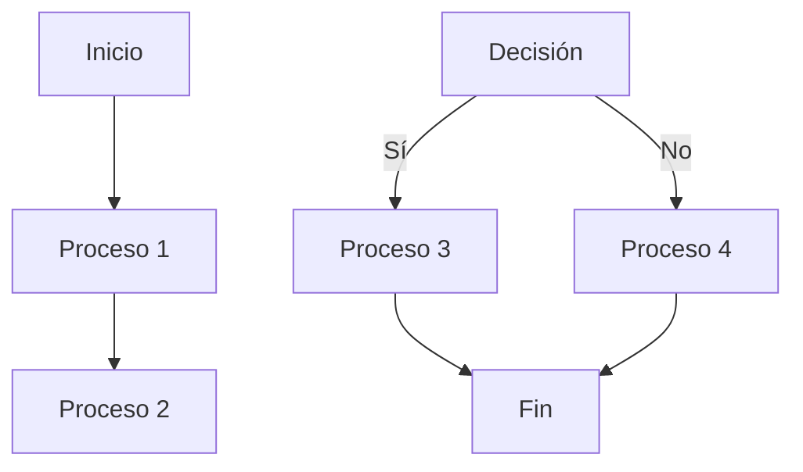
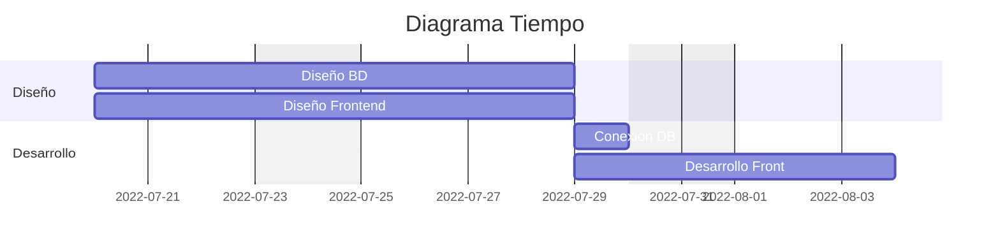

# Practica 1

## main.cpp
#include <Arduino.h>

#define LED_BUILTIN 20

#define DELAY 500

void setup()
{

Serial.begin(115200);

pinMode(LED_BUILTIN, OUTPUT);
}

void loop()
{

digitalWrite(LED_BUILTIN, HIGH);

Serial.println("ON");

delay(DELAY);

digitalWrite(LED_BUILTIN, LOW);

Serial.println("OFF");

delay(DELAY);
}

# Diagrama de flujos (ejemplo)

# Diagrama de tiempos (ejemplo)

# Tiempo libre del procesador

Para determinar el tiempo libre del procesador, necesitamos restar el tiempo total por iteración del período total del bucle loop(). 

Tiempo libre del procesador = Período total del bucle - Tiempo total por iteración
= 1000 ms - 1000 ms
= 0 segundos

Es decir, el tiempo libre del procesador es 0 segundos, lo que significa que el procesador está completamente ocupado ejecutando el código en el bucle loop() y no tiene tiempo adicional disponible.
